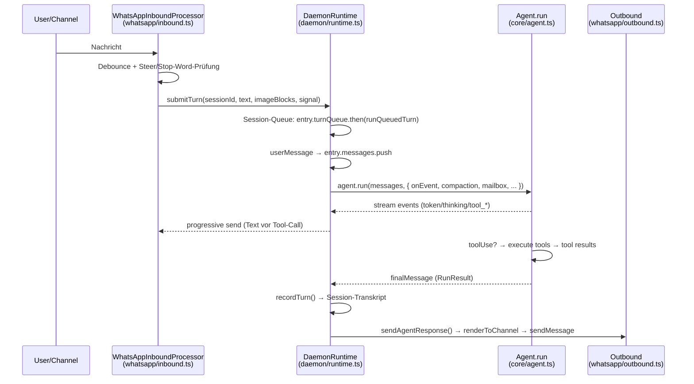
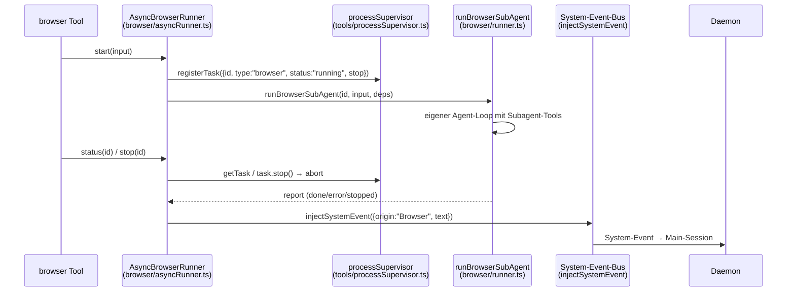
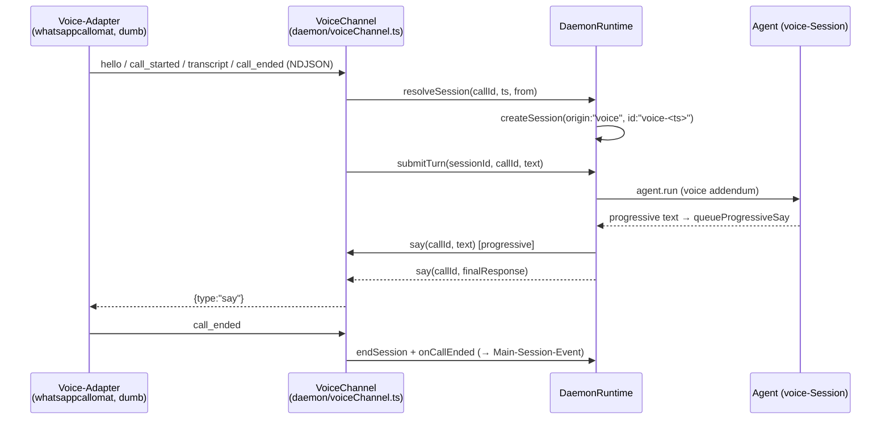

# Architecture Map — Harness

> Navigationskarte für Menschen **und** für günstige Modelle. Ziel: eine 30-Minuten-Repo-Sichtung
> auf Minuten schrumpfen. Alle Pfade relativ zum Repo-Root. Alle Aussagen tragen Datei-Anker.

Stand: 2026-08-13 · Basis: `main` @ `63abb4d` · Verwandte Doku: `docs/architecture/`, `docs/audit/`, `docs/changes/`

---

## 1. Packages & Verantwortungen

Monorepo (pnpm workspace, `pnpm-workspace.yaml`), zwei Pakete plus `examples/`.

| Paket | Verantwortung | Einstiegspunkt | hängt von |
|-------|---------------|----------------|-----------|
| `packages/core` | Wiederverwendbarer Agent-Loop-Kern. Tools, `createAgent`, Config, Skills, Profiles, Browser-Subsystem. **Kein** TUI/React/CLI. | `packages/core/src/lib.ts` (Public Surface) | `@mariozechner/pi-ai` |
| `packages/agent` | Persönlicher Agent: Daemon, TUI, CLI, Memory, WhatsApp-Gateway, Voice, Cron, Output-Pipeline. | `packages/agent/src/index.tsx` (CLI/TUI-Bin `harness`) · `packages/agent/src/lib.ts` (stabile Session-Read-API) | `@harness/core`, `baileys`, `ink`, `croner` |

### Einstiegspunkte im Detail

- **Daemon-Main (Runtime):** `packages/agent/src/daemon/runtime.ts` → `DaemonRuntime.start()` orchestriert alles (IPC-Server, Gateways, Voice-Channel, Cron, Heartbeat). Der eigentliche Prozessstart liegt in `packages/agent/src/daemon/commands.ts` → `daemonRun()`.
- **CLI:** `packages/agent/src/index.tsx` — subcommand-gesteuert (`daemon`, `chat`, `send`, `sessions`, `render`, `doctor`, `migrate-home`, `reload-config`). TTY → Ink-TUI (`packages/agent/src/cli/App.tsx`).
- **Tool-Registry:** `packages/core/src/tools/registry.ts` → `loadTools()` ist der zentrale Katalog. Jedes Tool eine Datei in `packages/core/src/tools/`.

**Datenfluss-Backbones:** `packages/agent/src/backends/types.ts` definiert `AgentBackend` (TUI-Abstraktion) mit zwei Implementierungen:
- `inProcessBackend.ts` — Agent-Loop lokal im Prozess („Werkbank-Modus“).
- `daemonClientBackend.ts` — delegiert per IPC an den Daemon.

---

## 2. Komponenten-Karte

Datei → Verantwortung → grobe Größe. Zahlen = `wc -l` (nur `src/`, ohne Tests).

### 2.1 Die beiden Monolithen

| Datei | Zeilen | Rolle |
|-------|-------:|-------|
| `packages/agent/src/daemon/runtime.ts` | **~4019** | Daemon-Laufzeit — alles, was den persistenten Agenten am Leben hält (Binnenstruktur §2.3) |
| `packages/core/src/core/agent.ts` | **~1133** | Der Agent-Loop selbst — `createAgent()` + `run()` (Binnenstruktur §2.2) |

### 2.2 `agent.ts` — Binnenstruktur (`packages/core/src/core/agent.ts`)

Der Loop ist eine einzige, dicht verschachtelte `main_loop`-Schleife in `run()`. Abschnitte (Zeilen in `agent.ts`):

| Verantwortung | Ort |
|---------------|-----|
| Typen (`RunOptions`, `RunResult`, `AgentEvent`, `TokenUsage`) | `:97–226` |
| Tool-Adapter `toPiTool` (Harness-`Tool` → pi-ai-`Tool`) | `:227` |
| Validierungs-Formatierung (TypeBox-Fehler → Text) | `:42–81` |
| **Turn-Start:** Abort-Checks, Memory-Hint, Mailbox-Drain, Auto-Compaction | `:564–616` |
| **Retry-Loop:** `stream()` mit `TimeoutController` + ThinkingStream + Retry-Klassifizierung/Backoff | `:637–798` |
| **Tool-Dispatch:** Conflict-Buckets (parallel + `conflictKey` seriell), Abort-Prüfung vor jedem Call, `executeToolWithAbort` | `:838–1044` |
| **Abort-Vertrag:** `internalAbortSignal` (Gateway-Restart, kein Annotation/Push) vs. `signal` (User, mit `pushAbortAnnotation` + `discardMailbox`) — an 4 Checkpoints (`:569`, `:574`, `:848`, `:1007`) | `:303–340`, `:1005–1031` |
| Compaction-Cool-down (60 s nach Fehlschlag) | `:562`, `:612` |
| Top-Level-Crash-Catch → Fehler-Annotation, kein Throw | `:1109–1130` |

Zentrale Nebenmodule (gleiches Verzeichnis): `thinkingStream.ts` (Leak-Prevention/`token_revoke`), `retryPolicy.ts` (Fehlerklassen/Backoff/Timeout), `compaction.ts` (Context-Window), `mailbox.ts` (Steering-Warteschlange), `metrics.ts`, `tokenTrace.ts`, `resolveModel.ts`, `memoryBackend.ts`.

### 2.3 `runtime.ts` — Binnenstruktur (`packages/agent/src/daemon/runtime.ts`)

`DaemonRuntime` (Klasse ab `:211`). Verantwortungsblöcke mit Ankern:

| Verantwortung | Ort (Zeilen) |
|---------------|--------------|
| State/Fields: `sessions` (Map), Profile, Tool-Sets, Restart-Flags, `turnActive` | `:212–264` |
| `start()` / `shutdown()` — Lifecycle, PID, MemoryService, Config, Agent, Gateways, IPC, Voice, Cron, Heartbeat | `:286–431` |
| **Restart/Self-Modify:** `requestRestartAfterTurn`, `makeRequestRestartCapability`, `performPendingRestartIfNeeded` (Deferred Restart) | `:642–761` |
| `reloadConfig`, `registerGateway`, `registerHeartbeat`, `runCronAgentJob` (Cron-Agent-Job + ad-hoc Job) | `:775–932` |
| **IPC Handler:** `handleIpcRequest` — `ping/status/create-session/list-sessions/submit-turn/resume/end/reload/shutdown` | `:966–1493` |
| **Turn-Queue:** Promise-Chaining pro Session (`entry.turnQueue.then(runQueuedTurn, …)`) | `:1229–1434` |
| **Initialisierung:** `loadDaemonConfig`, `initAgent` (Profile→Skills→Tools→createAgent→Prompt) | `:1497–1702` |
| **Gateway-Init:** `initGateways`, `initWhatsAppGateway` (ChannelPlugin + Callbacks) | `:1704–1784` |
| **WhatsApp-Turn:** `submitWhatsAppTurn` (Vision-Inline vs. image-Tool-Fallback, Progressive Send) | `:1833–2019` |
| **Session-Rotation:** `resolveWhatsAppSessionInner`, `rotateWhatsAppSession` (8 h-Inaktivität) | `:2046–2172` |
| **Steering:** `steerWhatsAppSession` → `entry.mailbox.push` | `:2190` |
| **Voice:** `resolveVoiceSession`, `submitVoiceTurn` (Progressive Speech), `onOutboundVoiceCallStarted`, `onVoiceCallEnded`, `onOutboundVoiceCallEnded` | `:2220–2585` |
| **Capability-Injection:** `channelFileSender`, `channelStickerSender`, `voiceReportToMainSession`, `voiceCallStarter` (Registry-Gate + Rate-Limit) | `:2534–2690` |
| **Profile/Model:** `applyProfileToolPolicy`, `resolveProfile`, `agentContextFor`, `resolveModelRef`, `findConfigModel` | `:2605–3083` |
| **Slash-Commands:** `handleChannelSlashCommand`, `handleSkillsOverview`, `handleSkillToggle`, `handleDeployCommand`, `executeSessionSlashCommand` | `:2957–3706` |
| **Heartbeat + Metriken:** `startHeartbeat`, `recordDaemonMetric` | `:3707–3960` |

### 2.4 Session-Store (`packages/agent/src/core/session.ts`, ~1301)

Persistenz-Schicht: Transcripts + Index, `createSession`, `recordTurn`, `loadSession`, `listSessions`, `turnsToMessages`, `estimateContextTokens`, `migrateLegacySessionFiles`. Stabile Read-API wird in `packages/agent/src/lib.ts` re-exportiert (für Distillation-Pipeline).

### 2.5 Kernmodule (Größe → Verantwortung)

**Core (`packages/core/src/`):**

| Datei | Zeilen | Verantwortung |
|-------|-------:|---------------|
| `core/agent.ts` | 1133 | Agent-Loop (§2.2) |
| `tools/exec.ts` | 542 | Shell-Tool (Timeout, Sicherheit) |
| `tools/processSupervisor.ts` | 386 | Singleton für Child-Prozesse **und** in-process Tasks (`register`, `registerTask`, `getTask`, GC) |
| `core/retryPolicy.ts` | 372 | LLM-Retry: `classifyError`, Backoff, `TimeoutController` |
| `core/compaction.ts` | 370 | Context-Compaction (`compactSession`, `shouldCompact`) |
| `config.ts` | 352 | `loadConfig`, Config-Typen (Modelle, Web, Browser, Image) |
| `browser/engine.ts` | 351 | Playwright-Browser-Engine |
| `browser/runner.ts` | 312 | `runBrowserSubAgent` — eigener Agent-Loop mit Browser-Tools |
| `core/thinkingStream.ts` | 309 | Thinking/Reasoning-Leak-Prevention, `token_revoke` |
| `browser/subAgentTools.ts` | 273 | Subagent-Toolset (`browser_navigate`, `browser_snapshot`, `browser_click`, …) |
| `browser/asyncRunner.ts` | 265 | Async-Browser-Task: `start/status/stop`, Completion-Event via `injectSystemEvent` |
| `tools/process.ts` | 260 | Prozess-Tool (Liste/Status/Signal) |
| `tools/registry.ts` | 129 | `loadTools`/`findTool` — zentraler Tool-Katalog |
| `tools/types.ts` | 125 | `Tool`-Interface, `ToolCallContext`, `ok`/`err`, `conflictKey` |
| `config/paths.ts` | 127 | **Einzige Pfad-Quelle** (`resolveHarnessPaths`, `ensureDirs`) |

**Agent (`packages/agent/src/`):**

| Datei | Zeilen | Verantwortung |
|-------|-------:|---------------|
| `daemon/runtime.ts` | 4019 | Daemon-Runtime (§2.3) |
| `core/session.ts` | 1301 | Session-Persistenz (§2.4) |
| `daemon/commands.ts` | 601 | CLI-Befehle (daemon start/stop/status, send, chat) |
| `whatsapp/plugin.ts` | 573 | `createWhatsAppPlugin` → `ChannelPlugin` |
| `whatsapp/inbound.ts` | 422 | Debounce, Steer, Stop-Word-Abort, 8 h-Rotation |
| `daemon/types.ts` | 382 | IPC-Protokoll, Gateway/Channel-Interfaces, Voice-Typen, DaemonConfig |
| `whatsapp/client.ts` | 373 | Baileys-Client-Wrapper |
| `mail/poller.ts` | 354 | IMAP-Mail-Poller (System-Events) |
| `core/statusSummary.ts` | 343 | `/status`-Zusammenfassung |
| `backends/inProcessBackend.ts` | 321 | In-Process-Backend (TUI lokal) |
| `daemon/deploy.ts` | 315 | `/deploy` — Safe-Deploy (Git-Worktree, Build-Gate) |
| `core/memoryService.ts` | 296 | Memory + QMD-Index (SQLite WAL) |
| `daemon/jobs.ts` | 281 | Cron-Job-Parser (Markdown-Frontmatter) |
| `daemon/scheduler.ts` | 269 | `CronScheduler` (croner, jitter, fs.watch-Reload) |
| `daemon/ipc.ts` | 257 | Unix-Socket-IPC (NDJSON, Streaming) |
| `daemon/voiceChannel.ts` | 248 | Voice-IPC-Server (NDJSON), call→session/socket-Mapping |
| `stickers/library.ts` | 237 | Sticker-Bibliothek (WebP, Index) |
| `backends/daemonClientBackend.ts` | 207 | IPC-Client-Backend (TUI fern) |
| `daemon/process.ts` | 189 | PID-File, Prozess-Discovery/Kill |
| `whatsapp/voice.ts` | 188 | `transcribeVoice` (STT) |
| `daemon/voiceOutbound.ts` | 175 | Voice-Registry (fail-closed) + Rate-Limit |
| `core/qmdBackend.ts` | 176 | QMD-Store-Backend für Memory |
| `daemon/selfModify.ts` | 81 | Restart-Marker, Git-Head, Restart-Ping |
| `daemon/deploy.ts` + `restartPing.ts` + `restartMarker.ts` + `curatorPing.ts` + `scripts.ts` | — | Self-Modify-Bausteine + Script-Job-Registry (`metrics-rotation`, `curator-ping`) |
| `output/` (index, canonical, capabilities, preview, renderers) | — | Markdown→Channel-Rendering (AST, Tier-System) |

### 2.6 Tool-Inventar (`packages/core/src/tools/`)

`loadTools()` in `registry.ts` registriert (Standard-Set):

`readFile`, `exec`, `process`, `write`, `edit`, `send_file`, `send_sticker`, `request_restart`, `call_user`, `report_to_main_session`, `search_memory`, `web_search`, `web_fetch` + bedingt `load_skill`/`find_skill` (Skills), `browser` (Browser-Option), `image` (Vision).

Siehe auch `docs/tools/` für die Tool-Specs.

---

## 3. Zentrale Flows (Mermaid)

### (a) Turn-Lifecycle — Inbound → Queue → `agent.run` → Outbound



### (b) Tool-Dispatch + Capability-Injection

```mermaid
flowchart LR
    subgraph Core[core]
        T[Tool {name, parameters, execute, conflictKey?}]
        C[ToolCallContext]
    end
    subgraph Daemon[runtime.ts]
        CAP[Capabilities: channelFileSender<br/>voiceCallStarter<br/>voiceReportToMainSession<br/>requestRestart]
    end
    subgraph Loop[agent.ts run]
        V[Value.Check parameters] --> B[Buckets: conflictKey seriell, Rest parallel]
        B --> E[executeToolWithAbort]
        E -->|context| C
    end
    T --> V
    CAP -->|injiziert in RunOptions| C
    C --> T
```

### (c) Hintergrund-Task / Subagent (Browser async)



### (d) Voice-Call-Flow — Adapter ↔ Daemon via IPC



---

## 4. Rezepte — „das ist das Muster, kopiere das“

### Tool anlegen

1. Neue Datei `packages/core/src/tools/<name>.ts`.
2. Muster (klarstes Beispiel): `packages/core/src/tools/readFile.ts` —
   - `Type.Object({...})` für Parameter,
   - `export const readFileTool: Tool<typeof Args> = { name, description, parameters, async execute(args, context) { return ok(...) / err(...) } }`.
3. In `packages/core/src/tools/registry.ts` importieren und in `loadTools()`-Array aufnehmen (bzw. bedingt wie `browser`/`image`/`load_skill`).
4. In `packages/core/src/lib.ts` re-exportieren.
5. Test: `packages/core/tests/tools/<name>.test.ts` (Vitest).

### Daemon-Capability anlegen (Tool ← Daemon-Callback)

Muster: `call_user` → `voiceCallStarter` bzw. `send_file` → `channelFileSender`.
1. Feld in `ToolCallContext` (`packages/core/src/tools/types.ts`) und in `RunOptions` (`packages/core/src/core/agent.ts`) ergänzen.
2. Tool liest `context.<capability>`; fehlt sie → `err("...")` (fail-closed, kein Crash).
3. Daemon injiziert sie in `runtime.ts` bei `agent.run(...)` — Anker: `submitWhatsAppTurn` (`runtime.ts:1928`) und `submitVoiceTurn` (`runtime.ts:2318`).
4. Die Daemon-Implementierung (z. B. `channelFileSender`, `voiceCallStarter`) liegt als `private readonly`-Callback in `runtime.ts:2534–2690`.

### Channel anlegen

1. Implementiere `ChannelPlugin extends GatewayAdapter` — Muster: `packages/agent/src/whatsapp/plugin.ts` → `createWhatsAppPlugin`.
2. Interfaces: `packages/agent/src/daemon/types.ts` (`GatewayAdapter`, `ChannelPlugin`, `ChannelPluginContext`).
3. Registrierung in `initGateways()`/`initWhatsAppGateway()` (`runtime.ts:1704–1784`) über `registerGateway()`.
4. Channel-Capabilities (maxLength, MIME, Sticker, Tabellen-Tier) in `packages/agent/src/output/capabilities.ts` (`MATRIX` + `getCapabilities`).

### Subagent anlegen

Muster: Browser-Subagent.
- Sync: `packages/core/src/browser/runner.ts` (`runBrowserSubAgent`) — eigener `createAgent` mit Subagent-Toolset aus `subAgentTools.ts`.
- Async (Task mit `start/status/stop` + Completion-Event): `packages/core/src/browser/asyncRunner.ts` (`createAsyncBrowserRunner`) — registriert einen `Task` im `processSupervisor`, meldet Abschluss via `injectSystemEvent`.
- Der Daemon verdrahtet `injectSystemEvent` → `this.injectSystemEvent(event)` in `runtime.ts` (`initAgent`, `loadTools`-Aufruf, `runtime.ts:1652`).

### Neuen Tool-Typ / Subagent-Toolset anlegen

`packages/core/src/tools/processSupervisor.ts` ist der generische Mechanismus: `Task` (in-process, `id/status/summary/artifactPaths/stop`) neben `Session` (Child-Prozess). Ein neuer Task-Typ erweitert `TaskType` (aktuell nur `"browser"`) und wird über `registerTask`/`getTask` verwaltet. Das Tool legt den Task an und exponiert `status`/`stop` als Tool-Argumente (Muster: `browser`-Tool in `packages/core/src/tools/browser.ts`).

### Cron-Job anlegen

1. Job-Datei `$HARNESS_STATE/jobs/*.md` mit Frontmatter (`name`, `schedule`, `type: agent|script`, `agent`, `once`, `jitter`) — Format/Parser: `packages/agent/src/daemon/jobs.ts`.
2. `type: script` → Funktion in `packages/agent/src/daemon/scripts.ts` via `registerScriptJob("name", fn)`.
3. Scheduling: `packages/agent/src/daemon/scheduler.ts` (croner + fs.watch-Reload).

---

## 5. Bekannte Schmerzpunkte (Refactor-Hebel)

Quellen: Review-Liste in `docs/audit/` und `docs/changes/`. Diese Stellen sind der wiederkehrende Wartungsaufwand.

| Schmerzpunkt | Wo | Hebel |
|--------------|----|-------|
| **Turn-Persistenz (4×)** — Slice-Berechnung, Compaction-Interaktion, Intra-Turn-Persistenz fehlt, kein IPC-Read-Endpoint | `runtime.ts` (submit-turn `:1359–1396`, whatsapp `:1972–1997`, voice `:2357–2381`), `inProcessBackend.ts`, `session.ts` | `docs/audit/session-logging-audit.md`, `docs/changes/fix-session-logging-batch.md` — Slice+Persistenz ist dreifach dupliziert, kein gemeinsamer `persistTurn` |
| **Channel-Seams** — WhatsApp-Logik in `runtime.ts` verwoben (Session-Rotation, Progressive Send, Presence) statt im Plugin | `runtime.ts` (WhatsApp-Block `:1833–2172`) | Channel-spezifisches in `whatsapp/` ziehen; `runtime.ts` nur noch generisches Routing |
| **Prozess-Lebenszyklus (4×)** — Start/Stop/Deferred-Restart/Self-Modify verteilt auf mehrere Dateien + Flags | `runtime.ts` (Restart-Block `:642–761`), `process.ts`, `selfModify.ts`, `deploy.ts`, `restartPing.ts`, `restartMarker.ts` | `docs/architecture/self-modification.md` (verbindliches Runbook); Zustandsmaschine statt boolescher Flags (`turnActive`, `selfModifyInFlight`, `pendingRestartReason`, `postRestartFollowUpActive`) |
| **Abort-Vertrag** — zwei Abort-Arten (`signal` vs. `internalAbortSignal`) mit subtil unterschiedlicher Semantik, 4 Checkpoints | `core/agent.ts` (`:569`, `:574`, `:848`, `:1007`) + `RunOptions`-Doku (`:100–108`) | Vertrag explizit dokumentieren/typen; siehe `docs/changes/fix-abort-resilience.md`, `feat-abort-annotation.md` |
| **Monolith runtime.ts** — 4019 Zeilen, 9+ Verantwortungsblöcke | `runtime.ts` | In Verantwortungsmodule zerlegen (siehe §2.3-Tabelle als Schnittvorschlag) |

---

## 6. Kurz-Referenz: Wo finde ich was?

| Frage | Antwort |
|-------|---------|
| Was passiert bei einer Nachricht? | `whatsapp/inbound.ts` → `runtime.ts` `submitWhatsAppTurn` → `core/agent.ts` `run` |
| Wie werden Tools registriert? | `tools/registry.ts` `loadTools` |
| Was ist ein Tool? | `tools/types.ts` (`Tool`, `ToolResult`, `ToolCallContext`) |
| Wie redet CLI mit Daemon? | `daemon/types.ts` (IpcRequest/Response) + `daemon/ipc.ts` |
| Wo liegt Session-Persistenz? | `core/session.ts` |
| Wo ist die Pfad-Quelle? | `config/paths.ts` (`resolveHarnessPaths`) |
| Wie funktioniert Self-Modify/Deploy? | `daemon/deploy.ts`, `daemon/selfModify.ts` + `docs/architecture/self-modification.md` |
| Voice-Protokoll? | `daemon/voiceChannel.ts` + `docs/voice-ipc.md` |
| Output-Rendering? | `output/canonical.ts`, `output/capabilities.ts`, `output/renderers/` |
| System-Events (Mail/Browser/Curator)? | `runtime.ts` `injectSystemEvent` + `mail/poller.ts`, `browser/asyncRunner.ts`, `daemon/scripts.ts` |
