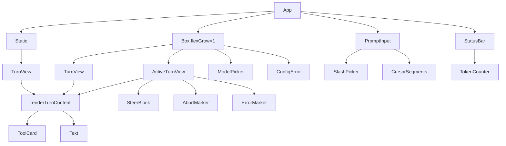
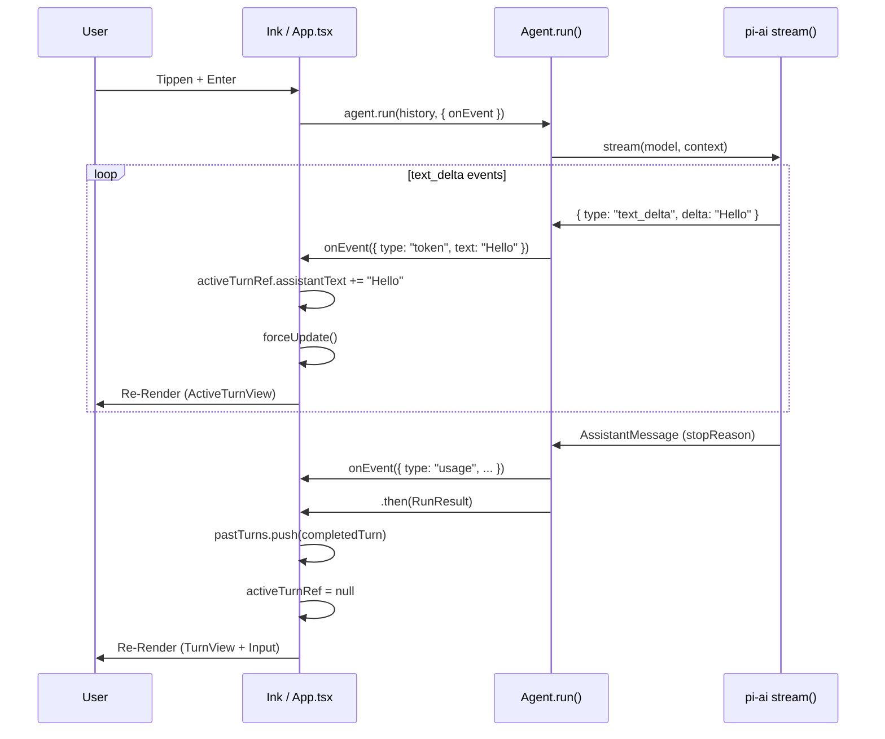

# CLI Architecture

**Stand:** 2026-05-17, HEAD `704b23cf7c5ee6ea3be01926c36807c04834abcc`  
**Stack:** Node ≥20 + TypeScript 5.6 (strict) + Ink 6 + React 19 + marked-terminal 7 + chalk  
**Core Dependency:** `@mariozechner/pi-ai` (^0.70.2)

---

## 1. Layout (drei Zonen)

```
┌──────────────────────────────────────────────────────────────┐
│                                                              │
│  Content-Bereich (scrollable)                                │
│  ├─ Static Turns   → Terminal-Scrollback (außer letzter)     │
│  ├─ Live Turn      → letzter abgeschlossener Turn            │
│  ├─ Active Turn    → streaming / thinking / tool / aborted   │
│  ├─ Steer-Blocks   → italic gray [steer]                     │
│  ├─ Config-Warnung → "No harness.config.json found..."       │
│  └─ Model-Picker   → bei /model aktiv                        │
│                                                              │
├──────────────────────────────────────────────────────────────┤
│  ❯ Persistent Input (1 Zeile, immer sichtbar)                │
│    ├─ Slash-Picker (bei /...)                                │
│    └─ Cursor / Selection / History-Navigation                │
├──────────────────────────────────────────────────────────────┤
│  harness · model · status · usage · cwd                      │
│  ─── Status Bar (bottom, fixed 1 Zeile) ───                  │
└──────────────────────────────────────────────────────────────┘
```

### Warum kein `<Static>` für den letzten Turn?

`<Static>` rendert ein Item einmalig und entfernt es aus dem Live-Render-Baum ([Ink-Docs](https://github.com/vadimdemedes/ink#static)). Der letzte abgeschlossene Turn bleibt jedoch live, damit **Ctrl+O** (Toggle Tool Card) weiterhin funktioniert — ein Re-Render ist nötig, um `expanded` zu toggeln. Erst der *vorletzte* Turn wandert in `<Static>`.

Code: `src/cli/App.tsx:980-984`

```tsx
const staticTurns = pastTurns.slice(0, -1);
const liveTurns   = pastTurns.slice(-1);
```

---

## 2. Component Tree



**Komponenten-Übersicht (alphabetisch):**

| Komponente | Datei | Zweck |
|------------|-------|-------|
| `ActiveTurnView` | `App.tsx:240` | Rendert aktiven Turn + Steers + Status-Marker |
| `App` | `App.tsx:604` | Top-Level, State-Komposition, Event-Routing |
| `HelpCard` | `App.tsx:168` | Statische Hilfe-Anzeige (bei `/help`) |
| `PromptInput` | `App.tsx:271` | Text-Eingabe mit Cursor, Selection, History, Slash-Picker |
| `StatusBar` | `App.tsx:95` | Bottom-Zeile: Model · Status · Token-Counter · CWD |
| `ToolCard` | `App.tsx:138` | Karten-UI für einzelne Tool-Calls (pending/done/error) |
| `TurnView` | `App.tsx:218` | Rendert abgeschlossenen Turn mit Markdown |

### Markdown-Rendering

Assistant-Text wird via `marked` + `marked-terminal` in terminal-freundliches ASCII übersetzt. Konfiguration in `src/cli/App.tsx:19-42`:

- **Listen:** Bullet `•`, Einrückung 2 Spaces, kein `#`-Prefix.
- **Überschriften:** `showSectionPrefix: false`, H1 bold+underline (cyan), H2+ bold (cyan).
- **Code:** Inline mit Backticks (`\`code\``) in gray, Blöcke 2-Space-indented in gray.
- **Farben:** cyan (Headings/StatusBar), gray (Code/Blockquote/HR), blue (Links).

---

## 3. Session State & Conversation History

### Wo lebt der State?

Der gesamte Session-State lebt in `App.tsx` als React-State und Refs. Es gibt **keinen globalen State-Manager**.

**React State (`useState`):**

| State | Typ | Zweck | Init |
|-------|-----|-------|------|
| `pastTurns` | `CompletedTurn[]` | Abgeschlossene Turns | `[]` |
| `inputHistory` | `string[]` | Eingabe-History für ↑/↓ | `[]` |
| `sessionUsage` | `TokenUsage \| undefined` | Aggregierte Token-Zahl | `undefined` |
| `termSize` | `{ columns, rows }` | Terminal-Größe für Resize | `stdout.columns/rows` |
| `activeModel` | `Model<Api>` | Aktives LLM-Modell | `getModel("minimax", "MiniMax-M2.7")` |
| `configModels` | `ConfigModel[]` | Aus `harness.config.json` | `[]` |
| `configError` | `string \| undefined` | Config-Lade-Fehler | `undefined` |
| `showModelPicker` | `boolean` | Model-Picker sichtbar? | `false` |

**Refs (`useRef`):**

| Ref | Typ | Zweck |
|-----|-----|-------|
| `activeTurnRef` | `ActiveTurn \| null` | Mutabler Turn während Streaming |
| `historyRef` | `Message[]` | Gesprächsverlauf für `agent.run()` |
| `abortControllerRef` | `AbortController \| null` | Signal für Loop-Abbruch |
| `mailboxRef` | `Mailbox` | Steering-Puffer |
| `isRunningRef` | `boolean` | Guard für Enter-Block |
| `userAbortedRef` | `boolean` | Markiert User-Abort |

### Turn-Lifecycle

```
User Input
  → handleSubmit()
  → historyRef.push({ role: "user", ... })
  → activeTurnRef.current = { status: "thinking", steers: [], ... }
  → agent.run(historyRef.current, { mailbox, signal, onEvent })
  → onEvent: token → assistantText wächst
  → onEvent: tool_call_start → ToolItem pending
  → onEvent: tool_call_done → ToolItem done
  → onEvent: turn_end → status: "complete"
  → .then() → pastTurns.push(completedTurn)
  → activeTurnRef.current = null
```

**Abgrenzung:**
- **Session:** Lebensdauer einer `App`-Instanz (bis `/quit` oder Ctrl+C Double-Tap)
- **Turn:** Ein Durchlauf von `agent.run()` (User-Input → LLM → ggf. Tools → Response)
- **Tool-Call:** Einzelner Aufruf innerhalb eines Turns
- **Tool-Result:** Ergebnis eines Tool-Calls, wird als `toolResult`-Message in `historyRef` gepusht

---

## 4. Agent Loop (run)

Pseudocode des Loop-Bodys in `src/core/agent.ts:150-329`:

```
for i = 0 .. maxIterations-1
  if signal.aborted
    discardMailbox(mailbox)
    return { aborted: true, completedTurns: i, reason: "signal", usage }

  drainMailbox(mailbox, history)          // Steers vor LLM-Call

  eventStream = stream(resolvedModel, context, { signal })

  try
    for await event in eventStream
      if event.type == "text_delta"
        onEvent({ type: "token", text: event.delta })
    response = await eventStream.result()
  catch err
    if signal.aborted or err.name == "AbortError"
      discardMailbox(mailbox)
      return { aborted: true, completedTurns: i, reason: "signal", usage }
    throw err

  totalInput  += response.usage.input
  totalOutput += response.usage.output
  totalTokens += response.usage.totalTokens
  onEvent({ type: "usage", inputTokens: totalInput, ... })

  if response.stopReason == "error"
    throw new Error(response.errorMessage)

  context.messages.push(response)
  drainMailbox(mailbox, history)           // Steers nach Stream

  if response.stopReason in ("stop", "length")
    return { aborted: false, turns: i+1, finalMessage: text, usage }

  if response.stopReason == "aborted"
    return { aborted: false, turns: i+1, finalMessage: "Anfrage wurde abgebrochen.", usage }

  if response.stopReason == "toolUse"
    if signal.aborted
      context.messages.pop()
      discardMailbox(mailbox)
      return { aborted: true, completedTurns: i, reason: "signal", usage }

    // Parallel-Execution mit Conflict-Buckets
    buckets = groupByConflictKey(toolCalls)
    results = await Promise.allSettled(buckets.map(executeBucket))
    context.messages.push(...sortedResults)
    onEvent({ type: "turn_end", turn: i+1 })

    if signal.aborted
      discardMailbox(mailbox)
      return { aborted: true, completedTurns: i, reason: "signal", usage }

    continue   // nächste Iteration

// maxIterations erreicht
discardMailbox(mailbox)
return { aborted: true, completedTurns: maxIterations, reason: "maxTurns", usage }
```

**Wichtige File:Line-Verweise:**
- Loop-Start: `src/core/agent.ts:150`
- Mailbox-Drain vor LLM: `src/core/agent.ts:157`
- Mailbox-Drain nach Stream: `src/core/agent.ts:195`
- Abort + Mailbox-Discard: `src/core/agent.ts:153`, `176`, `217`, `318`, `326`
- Token-Aggregation: `src/core/agent.ts:182-185`
- Tool-Bucket-Parallelisierung: `src/core/agent.ts:240-316`

---

## 5. Streaming Pipeline



**Warum `forceUpdate()`?**

Der Agent-Loop läuft in einer Promise-Kette (`.then()`). React-State-Updates innerhalb von Closures würden auf veraltete Werte zugreifen. Stattdessen:
- `activeTurnRef.current` wird mutiert
- `forceUpdate()` (Inkrement eines `useState`-Counters) triggert Re-Render
- Ink liest die aktualisierten Ref-Werte

Code: `src/cli/App.tsx:88-91`

```tsx
function useForceUpdate() {
  const [, setState] = useState(0);
  return useCallback(() => setState((s) => s + 1), []);
}
```

---

## 6. Tool Execution

### Parallelisierung mit Conflict-Buckets

Tools, die einen `conflictKey` definieren, werden gruppiert. Unabhängige Calls laufen parallel; Calls mit gleichem `conflictKey` sequentiell in Original-Reihenfolge.

Code: `src/core/agent.ts:240-260`

```ts
const buckets: { toolCall: PiToolCall; index: number }[][] = [];
const conflictMap = new Map<string, { toolCall: PiToolCall; index: number }[]>();

for (let idx = 0; idx < toolCalls.length; idx++) {
  const key = tool?.conflictKey?.(toolCall.arguments as never);
  if (key == null) {
    buckets.push([{ toolCall, index: idx }]);
  } else {
    const mapKey = `${toolCall.name}::${key}`;
    const existing = conflictMap.get(mapKey);
    if (existing) {
      existing.push({ toolCall, index: idx });
    } else {
      const bucket = [{ toolCall, index: idx }];
      conflictMap.set(mapKey, bucket);
      buckets.push(bucket);
    }
  }
}
```

### Atomarität während Abort

Ein einmal gestarteter Tool-Call läuft zu Ende (`await Promise.resolve(tool.execute(...))`), auch wenn das Signal abgebrochen wird. Das ist by design — halb ausgeführte File-Ops oder Shell-Commands wären gefährlicher als ein vollendeter Call.

Abort wirkt sich erst auf **zukünftige** Calls in einem Bucket oder auf die nächste Iteration aus.

Code: `src/core/agent.ts:250-270`

---

## 7. Mailbox / Message Steering

### Was ist Steering?

Während der Agent läuft (LLM-Stream oder Tool-Ausführung), kann der User Korrekturen oder Ergänzungen senden, ohne einen neuen Turn zu starten. Diese Steers landen in einer Mailbox und werden vor dem nächsten LLM-Call als System-Message injiziert.

### Mailbox-Instanz

Die Mailbox lebt als Ref über die gesamte Session:

Code: `src/cli/App.tsx:619`

```tsx
const mailboxRef = useRef<Mailbox>(createMailbox());
```

### Poll-Punkte

1. **Vor dem LLM-Call** (`agent.ts:157`): Fängt Steers auf, die während der vorherigen Tool-Ausführung gesendet wurden.
2. **Nach Stream-Ende** (`agent.ts:195`): Fängt Steers auf, die während des LLM-Streams gesendet wurden.

### Format der injizierten System-Message

Code: `src/core/agent.ts:93-98`

```ts
function formatSteerMessage(steers: string[]): string {
  return (
    `⚠ Steer während Tool-Call. Behandle als Korrektur/Ergänzung der ursprünglichen Aufgabe:\n` +
    steers.map((s) => `"${s}"`).join("\n")
  );
}
```

### Steer + Abort

Wenn der User gleichzeitig steert und abbricht (Ctrl+C), gewinnt Abort. Die Mailbox wird geleert, keine System-Message wird injiziert.

Code: `src/cli/App.tsx:959-962`

```tsx
if (isRunningRef.current && abortControllerRef.current) {
  userAbortedRef.current = true;
  abortControllerRef.current.abort();
  mailboxRef.current.drainAll();   // ← Mailbox leeren
  ...
}
```

### Edge-Cases

| Szenario | Verhalten |
|----------|-----------|
| Steer während Stream | Gesammelt, injiziert nach Stream-Ende |
| Steer während Tools | Gesammelt, injiziert vor nächstem LLM-Call |
| Steer + gleichzeitig Abort | Abort gewinnt, Mailbox wird verworfen |
| Mehrere Steers | Alle in einer System-Message kombiniert |

---

## 8. Slash-Commands & Pickers

### Registry

Code: `src/cli/commands.ts:6-11`

```ts
export const slashCommands: SlashCommandInfo[] = [
  { name: "/clear", description: "Clear history" },
  { name: "/help", description: "Show this help" },
  { name: "/model", description: "Switch model" },
  { name: "/quit", description: "Exit" },
];
```

### Slash-Autocomplete-Picker

- **Trigger:** Erstes Zeichen ist `/`
- **Filter:** Live-Filter auf `name.includes(query)` (Case-Insensitive)
- **Keybinds (im Picker):**
  - `↑/↓` — Navigation
  - `Tab / Enter` — Completes Command-Name ins Input, führt **nicht** aus
  - `Esc` — Schließt Picker
- **Auto-Close:** Bei Leerzeichen oder wenn kein Match

Code: `src/cli/App.tsx:344-392`

### Model-Picker

- **Trigger:** `/model` + Enter (im `handleSubmit`)
- **Datenquelle:** `harness.config.json` → `configModels`
- **Fallback:** Hartcodierter Default `minimax/MiniMax-M2.7`
- **Keybinds:**
  - `↑/↓` — Navigation
  - `Enter / Tab` — Modell wechseln
  - `Esc` — Abbrechen
- **Wechsel:** `agent.setModel(newModel)` + `setActiveModel(newModel)`

Code: `src/cli/App.tsx:695-701` (Trigger), `src/cli/App.tsx:902-941` (Navigation)

---

## 9. Token Usage & Counter

### Aggregation im Core

Code: `src/core/agent.ts:147-149` (Initialisierung), `182-185` (Update)

```ts
let totalInput = 0;
let totalOutput = 0;
let totalTokens = 0;

// Nach jeder AssistantMessage:
totalInput += response.usage.input;
totalOutput += response.usage.output;
totalTokens += response.usage.totalTokens;
onEvent?.({ type: "usage", inputTokens: totalInput, outputTokens: totalOutput, totalTokens });
```

### Session-Aggregation in App.tsx

Code: `src/cli/App.tsx:612` (State), `820-830` (Kumulation)

Der Agent liefert pro `run()` ein `result.usage` mit der kumulierten Usage **dieses Turns** (inkl. interner Tool-Loop-Iterationen). `App.tsx` addiert diese Werte auf den Session-State:

```ts
if (result.usage) {
  setSessionUsage((prev) =>
    prev
      ? {
          inputTokens: prev.inputTokens + result.usage.inputTokens,
          outputTokens: prev.outputTokens + result.usage.outputTokens,
          totalTokens: prev.totalTokens + result.usage.totalTokens,
        }
      : result.usage
  );
}
```

**Verhalten:**
- Counter ist **monoton wachsend** über die gesamte Session
- `/clear` setzt `sessionUsage` auf `undefined` → Counter verschwindet (neue Session)
- `/model`-Switch lässt den Counter unverändert (Session läuft weiter)

### Anzeige in der StatusBar

Code: `src/cli/App.tsx:74-80` (Formatierung), `95-112` (Rendering)

```ts
function formatTokens(n: number): string {
  if (n < 1000) return String(n);
  return `${(n / 1000).toFixed(1)}k`;
}
```

**Color-Coding:**
- `> 80%` der `contextWindow` → gelb
- `> 95%` der `contextWindow` → rot

### Konfiguration der Context-Window-Größe

Die `contextWindow` kommt vom `activeModel`-Objekt (pi-ai liefert sie). Fallback ist `?`.

---

## 10. Keybinds Reference

| Keybind | Context | Aktion | Code |
|---------|---------|--------|------|
| `Enter` | Input, `!isRunning` | Submit → `handleSubmit()` | `App.tsx:424-432` |
| `Enter` | Input, `isRunning` | Blockiert (kein Submit) | `App.tsx:424-432` |
| `Shift+Enter` | Input | Newline im Input | `App.tsx:416-423` |
| `↑` | Input, Picker offen | Picker-Navigation (hoch) | `App.tsx:367-371` |
| `↓` | Input, Picker offen | Picker-Navigation (runter) | `App.tsx:373-377` |
| `↑` | Input, Picker zu | History-Navigation (älter) | `App.tsx:443-452` |
| `↓` | Input, Picker zu | History-Navigation (neuer) | `App.tsx:462-471` |
| `←/→` | Input | Cursor-Bewegung | `App.tsx:484-497` |
| `Shift+←/→` | Input | Text-Selection | `App.tsx:484-497` |
| `Ctrl+A` | Input | Select All | `App.tsx:410-415` |
| `Ctrl+Backspace` | Input | Delete Word | `App.tsx:395-408` |
| `Alt+Backspace` | Input | Delete Word | `App.tsx:395-408` |
| `Backspace` | Input | Delete Char / Selection | `App.tsx:498-507` |
| `Tab` | Input, Picker offen | Picker-Completion | `App.tsx:382-391` |
| `Esc` | Input, Picker offen | Picker schließen | `App.tsx:378-381` |
| `Ctrl+O` | Global | Toggle last Tool Card | `App.tsx:971-973` |
| `Ctrl+L` | Global | Clear screen (`setPastTurns([])`) | `App.tsx:965-967` |
| `Ctrl+C` | Global | Abort / Double-Tap Exit | `App.tsx:945-963` |
| `↑/↓` | ModelPicker | Model-Navigation | `App.tsx:903-910` |
| `Enter/Tab` | ModelPicker | Modell auswählen | `App.tsx:916-940` |
| `Esc` | ModelPicker | Picker schließen | `App.tsx:912-915` |

---

## 11. Abort Flow

### Ctrl+C Double-Press Behavior

Code: `src/cli/App.tsx:945-963`

```tsx
if (key.ctrl && inputStr === "c") {
  const now = Date.now();
  if (now - lastSigintRef.current < 500) {
    if (!isRunningRef.current) {
      process.exit(130);   // Double-Tap → Exit
    }
  }
  lastSigintRef.current = now;

  if (isRunningRef.current && abortControllerRef.current) {
    userAbortedRef.current = true;
    abortControllerRef.current.abort();
    mailboxRef.current.drainAll();   // Mailbox leeren
    if (activeTurnRef.current) {
      activeTurnRef.current = { ...activeTurnRef.current, status: "aborted" };
      forceUpdate();
    }
  }
  return;
}
```

### Was passiert im Agent?

1. `signal.aborted` wird `true`
2. Der nächste `await` im Loop wirft `AbortError` oder der Check `signal?.aborted` triggert
3. `discardMailbox(mailbox)` wird aufgerufen
4. Es wird `{ aborted: true, completedTurns: i, reason: "signal", usage }` zurückgegeben
5. `App.tsx` setzt `aborted: true` auf den Turn und verschiebt ihn in `pastTurns`

### Partial-Output-Verhalten

Der bisher generierte Text (`assistantText`) wird **nicht verworfen**. Der Turn landet in `pastTurns` mit `aborted: true` und dem bisherigen Text. Das ist der aktuelle Ist-Stand — es gibt keine separate "Partial-Context"-Logik.

---

## 12. File Map

### `src/cli/`

| Datei | Zweck |
|-------|-------|
| `App.tsx` | Hauptkomponente: Layout, State-Management, Event-Routing, Agent-Integration |
| `commands.ts` | Slash-Command-Registry (`/clear`, `/help`, `/model`, `/quit`) + Filter-Logik |

### `src/core/`

| Datei | Zweck |
|-------|-------|
| `agent.ts` | Agent-Loop: LLM-Streaming, Tool-Execution, Mailbox-Poll, Token-Aggregation, Abort-Handling |
| `mailbox.ts` | Steering-Puffer: `push`, `drainAll`, `isEmpty` |
| `parallel.ts` | Utility für parallele Tool-Bucket-Ausführung |

### `src/tools/`

| Datei | Zweck |
|-------|-------|
| `edit.ts` | Find-and-Replace Tool |
| `exec.ts` | Shell-Execution Tool (sync, timeout, No-Fly-List) |
| `execPty.ts` | PTY-Modus für interaktive Commands |
| `process.ts` | Background-Process Management |
| `readFile.ts` | Text- und PDF-Lesen |
| `write.ts` | Atomares Schreiben |
| `file_state.ts` | READ_REQUIRED-Tracking |
| `ringBuffer.ts` | RingBuffer für Background-Output |
| `registry.ts` | Tool-Registry + Discovery |
| `types.ts` | Gemeinsame Tool-Typen |

### Config-Dateien

| Datei | Zweck |
|-------|-------|
| `harness.config.json` | Runtime-Modell-Konfiguration (aus CWD gelesen) |
| `harness.config.example.json` | Beispiel-Konfiguration |
| `.env` | API-Keys (z. B. `MINIMAX_API_KEY`, `OPENAI_API_KEY`) — niemals committen |

---

## 13. Known Gaps & Caveats

### `<Static>`-Entscheidung und Performance

- `<Static>` verhindert Re-Renders für alte Turns → Performance bleibt stabil bei langen Sessions
- Der letzte Turn bleibt live → **Ctrl+O** funktioniert
- Bei >100 Turns ist der Scrollback natürlich lang, aber das ist Terminal-seitig kein Problem

### React Key Warning

In nicht-interaktiven Terminals erscheint sporadisch:
```
Encountered two children with the same key...
```
Dies ist ein pre-existing Warning, der auch vor Phase 1 auftrat. Root cause unklar — vermutlich Ink/React-Reconciler in non-TTY-Umgebungen.

### Partial-Context bei Abort

Der aktuelle Code verwirft bei Abort den laufenden Turn nicht. Der bisher generierte Text bleibt erhalten, aber es gibt keine "Partial-Context"-Logik, die dem User anbietet, den abgebrochenen Turn fortzusetzen. Verweis auf Tracker-Eintrag (sofern vorhanden).

### Model-Konfiguration

Config-Lookup mit Path-Scoping (`src/cli/config.ts`):

1. `--config <path>` — expliziter CLI-Override
2. `$PWD/harness.config.json` — Projekt-spezifische Config (CWD)
3. `$XDG_CONFIG_HOME/harness/config.json` — User-Default (XDG)
4. `~/.harness/config.json` — User-Default (Legacy)
5. **Fallback:** Hartcodierter Default (`minimax/MiniMax-M2.7`) mit gelber Warnung in der UI (`configError`)

Neue Modelle werden durch Einträge in einer der Config-Dateien hinzugefügt:
  ```json
  {
    "models": [
      { "provider": "minimax", "model": "MiniMax-M2.7", "alias": "MiniMax M2.7" }
    ]
  }
  ```
- Der `provider`-Wert muss von pi-ai unterstützt sein (`minimax`, `openai`, etc.)
- Der API-Key für den Provider muss in `.env` hinterlegt sein (z. B. `MINIMAX_API_KEY=<token>`)
- `getModel` erfordert für dynamische Strings einen `as unknown as ...` Cast (pi-ai strikte Typisierung)

### Fehlende Feature-Reports

Die Implementation-Reports für `cli-statusbar` und `cli-followups-a` fehlten ursprünglich in den Feature-Branches und wurden erst nachträglich committed.
